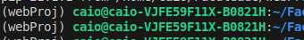
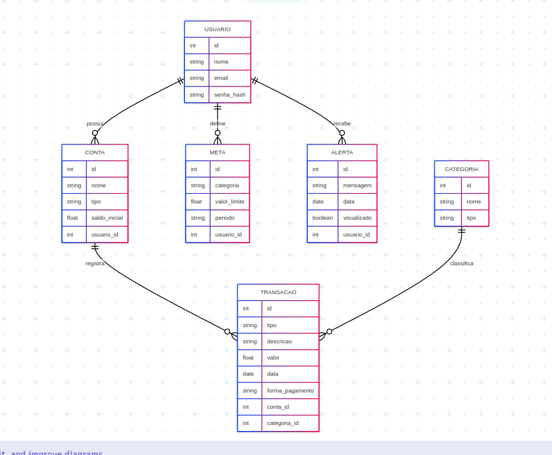

# web-dev-projeto
Repositório designado ao trabalho de programação web. O código do trabalho foi baseado nas seguintes aulas de Django: 
- [Aula Django 01](https://ufla-prog-web.github.io/site/aula-django-01/) 
- [Aula Django 02](https://ufla-prog-web.github.io/site/aula-django-02/)
- [Aula Django 03](https://ufla-prog-web.github.io/site/aula-django-03/)

## Comandos para utilização - Inicial
- Para trabalhar nessa aplicação, deve-se garantir que você tenha o `pip` instalado na sua máquina. O projeto foi criado utilizando da versão  **21.1.1** do `pip`
- Caso não tenha criado um ambiente virtual para execução da aplicação, escolha um diretório fora do escopo do repositório e execute o seguinte comando para criar um ambiente virtual.

```
python3 -m venv webProj
```
- Esse comando irá criar um diretório chamado `webProj` que armazenara todas as dependencias da aplicação. Esse diretório se chama ambiente virtual.

- Após a criação do ambiente virtual, sempre que for utilizar a aplicação deve-se inicia-lo com o código a seguir, lembrando que deve-se estar no diretório do ambiente virtual.

```
source webProj/bin/activate
```
- A saida será um terminal parecido com o a seguir:



</br>

- Após isto baixe as dependicias utilizando o comando:
```
pip install -r requirements.txt
```

## Comandos uteis para utilização

- Sempre que for utilizar, inicie o ambiente virtual com:

```
source webProj/bin/activate
```

- Sempre que for desativar o ambiente virtual:

```
deactivate
```

#### ⚠️ |  Lembre-se que os comando a seguir devem ser executados dentro do ambiente virtual. E todos os comando com `manage.py` devem estar no diretório da aplicação, aquele em que o arquivo `manage.py` se encontra, que no momento é `/portal_biblioteca`

- Sempre que for iniciar a aplicação:
```
python3 manage.py runserver
```


- Sempre que for criar migrations:

```
python3 manage.py makemigrations biblioteca
```

- Sempre que for aplicar as migrations:
```
python3 manage.py migrate
```

## Diagrama do banco de dados

